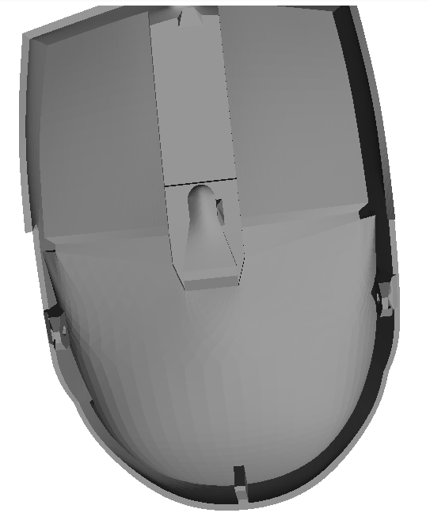
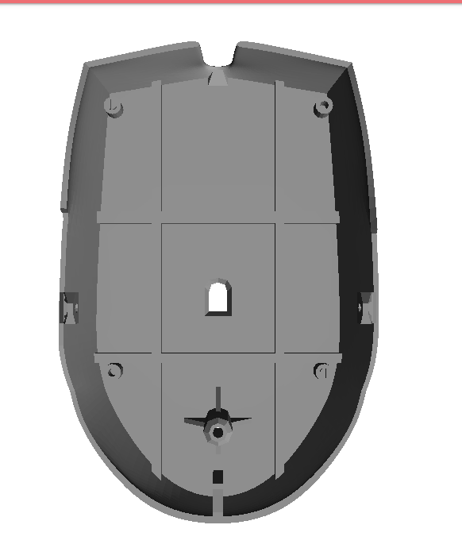
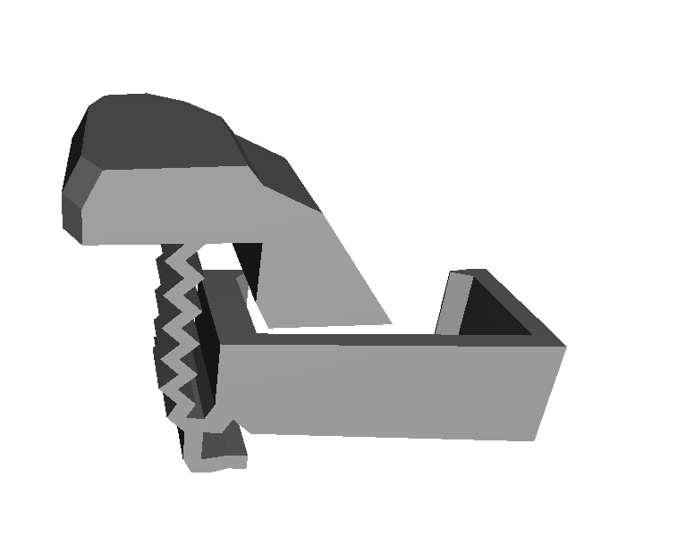
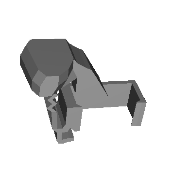
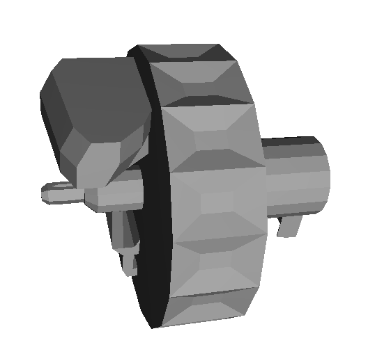
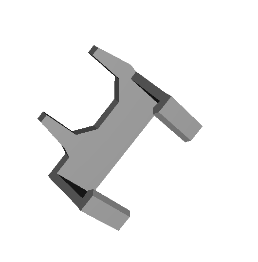
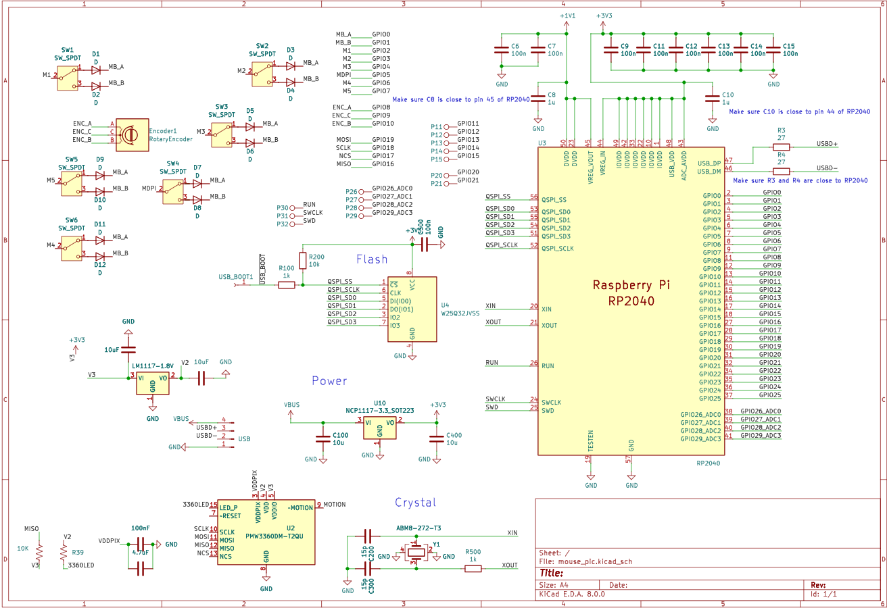
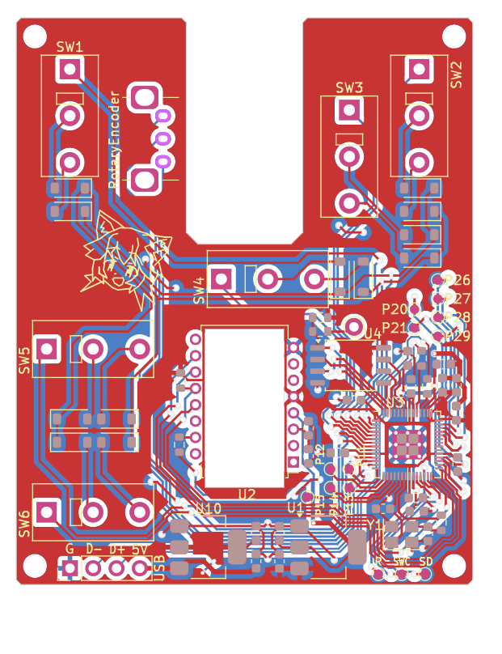

# Custom Mouse

This project is a custom-designed computer mouse made using a Raspberry Pi Pico board and a fully 3D-printed shell.  
All parts of the mouse — including the shell, buttons, and scroll wheel — were modeled, printed, and assembled manually.  
The PCB and schematic were designed to fit perfectly inside the case.

---

## Mouse Shell Renders

### Top Shell

### Bottom Shell

### Thumb Buttons

### Scroll Wheel

### Wheel Brace

---

## PCB Design

### PCB Schematic

### PCB Render

---

